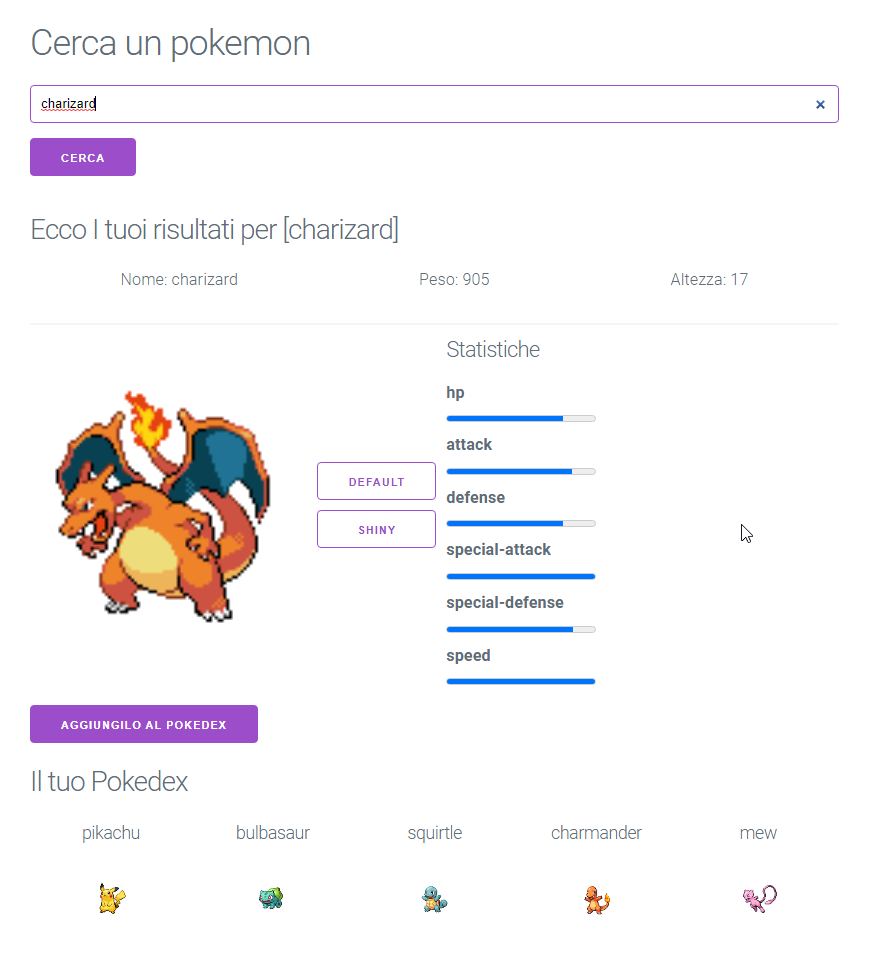

# Pokedex web App

## Description
The Pokédex Web App from the Italian Frontenders community and it is a comprehensive online encyclopedia for Pokémon trainers. It provides a user-friendly interface to explore and discover information about various Pokémon species. Whether you're a seasoned Pokémon trainer or just starting your journey, this app is your ultimate resource for learning about the Pokémon world.
## Features 
- Pokémon Search: Quickly search for Pokémon by name or number using the search bar. Get instant access to detailed information about each Pokémon, including its type, abilities, stats, evolution chain, and more.
- Statistics: Browse through an extensive collection of Pokémon species. Each entry includes essential details such as the Pokémon's name, number, type, and a captivating description. Explore different generations and regions to learn about Pokémon from various games.
- Favorites: Create a personalized collection of favorite Pokémon by saving them to your profile.
## Technology

  
 
  
  
  

## Demo
To see a live demo of the Pokedex web App, visit [Demo](https://www.massidev.com/portfolio/pokedex/).
## Installation
To run the Pokedex web app locally, follow these steps:
1. Clone the repository: `git clone https://github.com/massi-17/pokedex-web-app.git`
2. Navigate to the project directory: `cd pokedex-web-app`
3. Open the `index.html` file in your preferred web browser.
## Contributing
Contributions are welcome! If you want to contribute to this Pokedex web app, please follow these steps:
1. Fork the repository.
2. Create a new branch: `git checkout -b feature/your-feature`.
3. Make your changes and commit them: `git commit -m 'Add your feature'`.
4. Push to the branch: `git push origin feature/your-feature`.
5. Submit a pull request.
